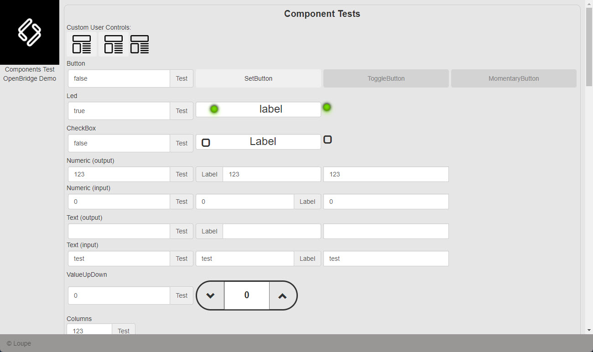
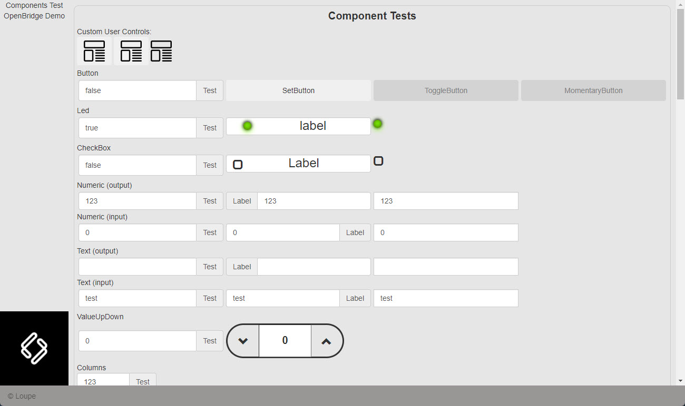
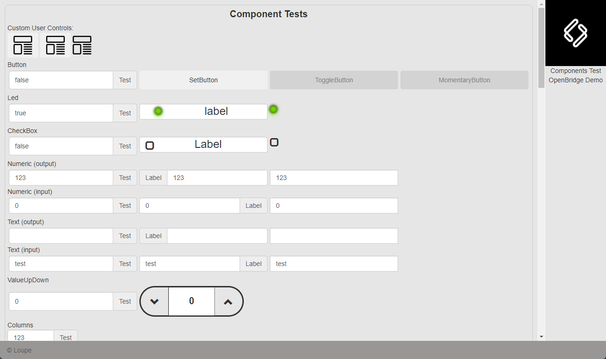
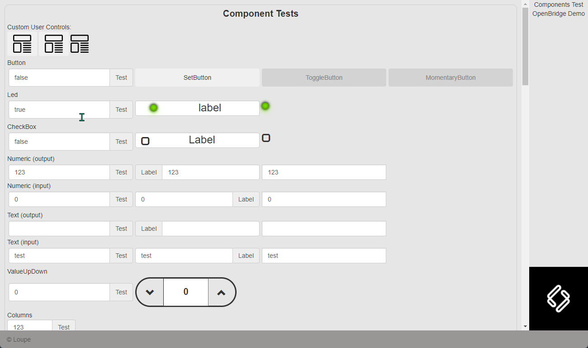
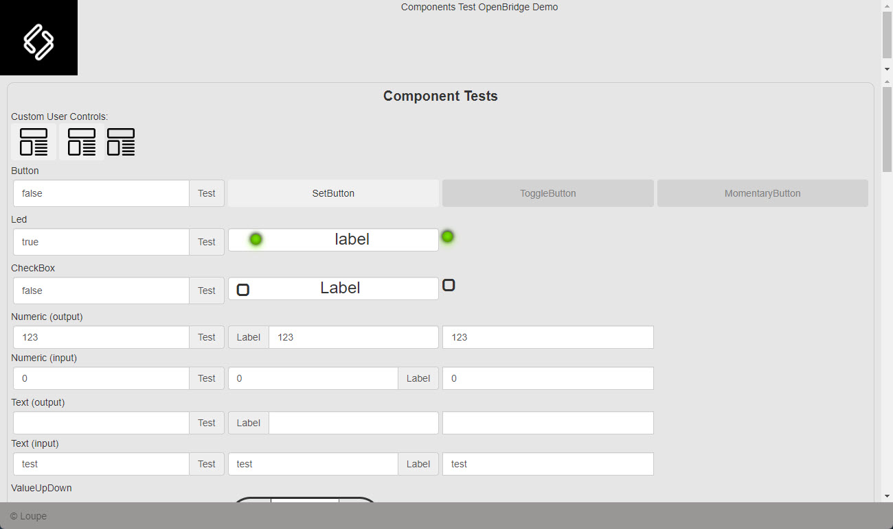
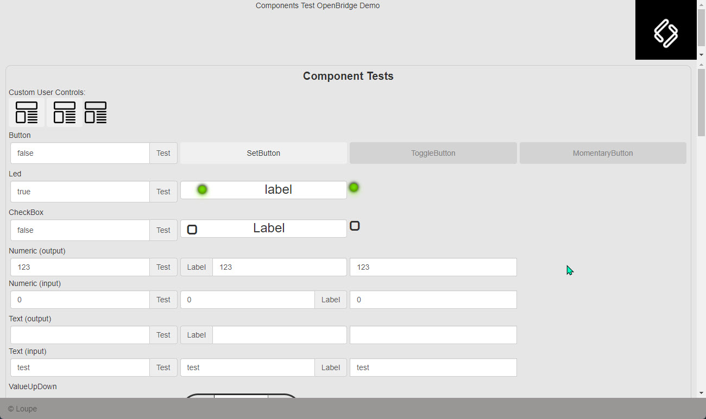
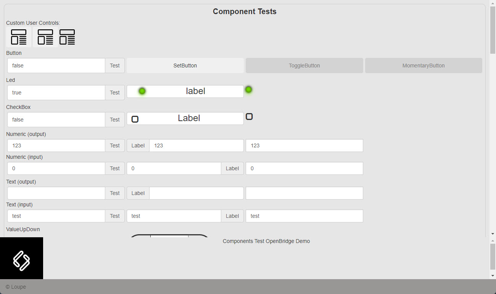
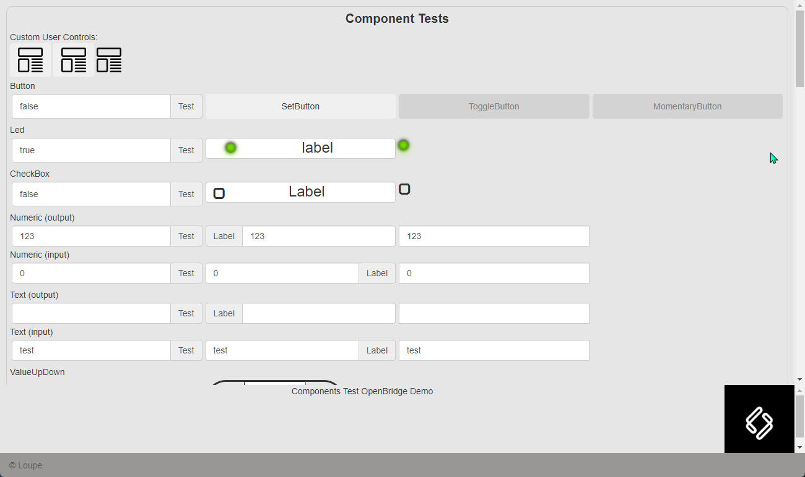

## Information
This tmplit is used to create a basic HMI layout.  Below are the variables that can be used to create the HMI layout

1. defaultMainScreen - initial screen to be loaded.
2. logoSource - directory path to logo image when applicable.
3. logoLocation - logo's location on navigation bar. 0 is for Left/ Top and 1 is for Right / Bottom.
4. footerDisabled - Footer is enabled by default.  Setting footerDisabled to true (as BOOL, not String) will disable Footer.
footerContent - Content to be displayed in footer.  
5. actions - arguments for tmplits-pageselect.  
See https://loupeteam.github.io/LoupeDocs/libraries/tmplitdocs/tmplitcomponents/pagelayout.html for more information. 
6. label - label for navigation button.  label can either be text or image.  
This is an argument for tmplits-pageselect. See https://loupeteam.github.io/LoupeDocs/libraries/tmplitdocs/tmplitcomponents/pagelayout.html for more information. 
7. template - handlebars file to be loaded.  
This is an argument for tmplits-pageselect. See https://loupeteam.github.io/LoupeDocs/libraries/tmplitdocs/tmplitcomponents/pagelayout.html for more information.
8. class - additional css classes for navigation buttons.  
This is an argument for tmplits-pageselect. See https://loupeteam.github.io/LoupeDocs/libraries/tmplitdocs/tmplitcomponents/pagelayout.html for more information.
9. footerContent - content for footer.  Default as Loupe

## Available HMI Layouts
There are 8 availbale layouts with different navigation bar locations and logo locations:
1. tmplit-basic-layout-left-nav with logo on top  
  

2. tmplit-basic-layout-left-nav with logo at the bottom  
  

3. tmplit-basic-layout-right-nav with logo on top  
  

4. tmplit-basic-layout-right-nav with logo at the bottom  
  

5. tmplit-basic-layout-top-nav with logo on top  
  

6. tmplit-basic-layout-top-nav with logo at the bottom  
  

7. tmplit-basic-layout-bot-nav with logo on top  
  

8. tmplit-basic-layout-bot-nav with logo at the bottom  
  

## Example: 
```handlebars
{{#> tmplit-basic-layout-top-nav
    defaultMainScreen='testComponents'
    logoSource="app/assets/logo.png"
    logoLocation='0'
    actions=(obj '[
        {label:"Components Test", template:"testComponents"},
        {label:"OpenBridge Demo", template:"OpenBridge"}
        ]')
}}
{{/tmplit-basic-layout-top-nav}}

<!-- If label for navigation button is an image instead of text, use  -->

{{#> tmplit-basic-layout-top-nav
    defaultMainScreen='testComponents'
    logoSource="app/assets/logo.png"
    logoLocation='0'
    actions=(obj '[
        {label:"", template:"testComponents"},
        {label:"OpenBridge Demo", template:"OpenBridge"}
        ]')
}}
{{/tmplit-basic-layout-top-nav}}

```

## CSS Variables:
Some CSS variables are used to simplify styling.

```css
    /* Main container */
    --main-container-overflow: auto;

    /* Nav Bar */
    /* Left/ Right Nav Bar */
    --navBar-minwidth: 10%;
    --navBar-maxwidth: 20%;

    /* Top/ Bottom Nav Bar */
    --navBar-minheight: 15%;
    --navBar-maxheight: 20%;

    --navBar-logo-padding: 0 0 0 0;
    --navBar-logo-margin: 0 0 0 0;
    --navBar-logo-text-align: center;
    --navBar-logo-img-width: 100%;
    --navBar-buttons-padding: 0 0 0 0;
    --navBar-buttons-margin: 0 0 0 0;
    --navBar-buttons-color: none;
    --navBar-buttons-text-align: center;
    --navBar-buttons-img-width: none;
    --navBar-buttons-indicator-background-color: rgb(182, 182, 182);
    --navBar-container-overflow: auto;
    --navBar-background-color: rgb(230, 230, 230);

    /* Main Content */
    --screen-item-color: none;
    --screen-text-align: left;
    --screen-overflow: auto;
    --screen-background-color: rgb(230, 230, 230);

    /* Footer */
    --footer-height: 5%;
    --footer-content-float: left;
    --footer-content-margin: 0 0 0 0;
    --footer-content-padding: 0 0 0 15px;
    --footer-opacity: 70%;
    --footer-background-color: rgb(153, 150, 150);
```
## Licensing

This project is licensed under the [MIT License]LICENSE.

