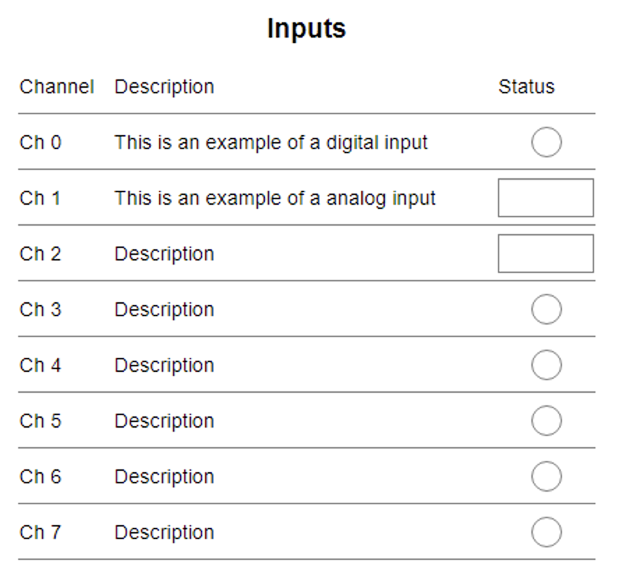

# TmplitTable

This is a container tmplit for TmplitTableRows. It can be given a title as the first context.



# Usage

```
{{#tmplit 'Table' 'Inputs'}}
        {{#tmplit 'TableRow'}}
            <span>Channel</span>
            <span>Description</span>
            <span>Status</span>
        {{/tmplit}}
        {{#tmplit 'TableRow'}}
            <span>Ch 0</span>
            <span>This is an example of a digital input</span>
            {{tmplit 'Led' data-var-name='tmplitTest:tmplit.SetButton'}}
        {{/tmplit}}
        {{#tmplit 'TableRow'}}
            <span>Ch 1</span>
            <span>This is an example of a analog input</span>
            {{tmplit 'Numeric' data-var-name='tmplitTest:tmplit.NumericOutput'}}
        {{/tmplit}}
        {{#tmplit 'TableRow'}}
            <span>Ch 2</span>
            <span>Description</span>
            {{tmplit 'Numeric' data-var-name='tmplitTest:tmplit.NumericOutput'}}
        {{/tmplit}}
        {{#tmplit 'TableRow'}}
            <span>Ch 3</span>
            <span>Description</span>
            {{tmplit 'Led' data-var-name='tmplitTest:tmplit.SetButton'}}
        {{/tmplit}}
        {{#tmplit 'TableRow'}}
            <span>Ch 4</span>
            <span>Description</span>
            {{tmplit 'Led' data-var-name='tmplitTest:tmplit.SetButton'}}
        {{/tmplit}}
        {{#tmplit 'TableRow'}}
            <span>Ch 5</span>
            <span>Description</span>
            {{tmplit 'Led' data-var-name='tmplitTest:tmplit.SetButton'}}
        {{/tmplit}}
        {{#tmplit 'TableRow'}}
            <span>Ch 6</span>
            <span>Description</span>
            {{tmplit 'Led' data-var-name='tmplitTest:tmplit.SetButton'}}
        {{/tmplit}}
        {{#tmplit 'TableRow'}}
            <span>Ch 7</span>
            <span>Description</span>
            {{tmplit 'Led' data-var-name='tmplitTest:tmplit.SetButton'}}
        {{/tmplit}}
    {{/tmplit}}
```

# CSS

Below are the css vars used for styling. These are read into the css properties and are empty by default. If they are null the html uses static default values. See the example on how to populate these variable in an application:

root {
  --tmplit-table-header-font-size
}

### Table Header
tmplit-table-header-font-size <br>
tmplit-table-header-font-weight <br>
tmplit-table-header-padding <br>
tmplit-table-header-text-align <br>
tmplit-table-header-color; md-sys-color-on-surface <br>
tmplit-table-header-background-color; md-sys-color-surface-container

### Table
tmplit-table-grid-template-columns <br>
tmplit-table-text-align <br>
tmplit-table-grid-template-rows <br>
tmplit-table-height <br>
tmplit-table-background-color; md-sys-color-surface-container <br>

## Licensing

This project is licensed under the [MIT License]LICENSE.

