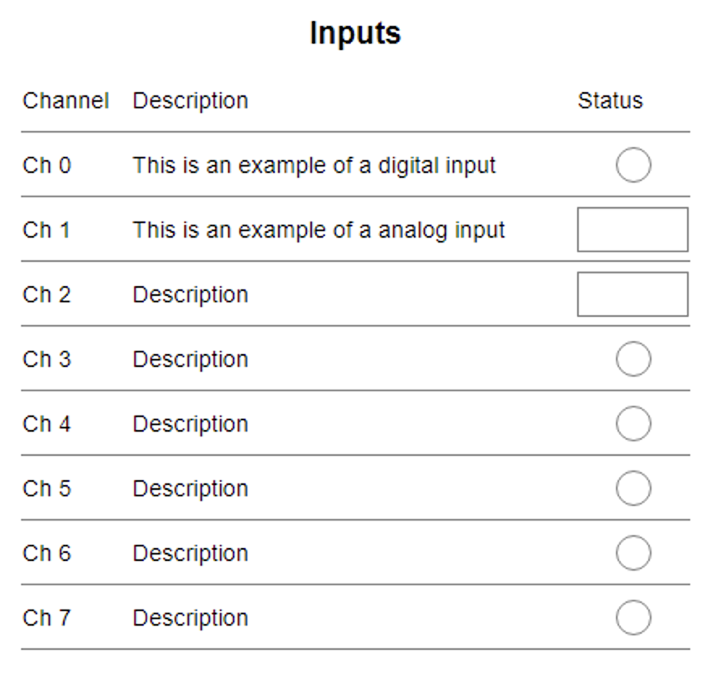

# TmplitTable

This is a element tmplit that is used within TmplitTable. Any tmplit can be inserted in the cells.



# Usage

```
{{#tmplit 'Table' 'Inputs'}}
        {{#tmplit 'TableRow'}}
            <span>Channel</span>
            <span>Description</span>
            <span>Status</span>
        {{/tmplit}}
        {{#tmplit 'TableRow'}}
            <span>Ch 0</span>
            <span>This is an example of a digital input</span>
            {{tmplit 'Led' data-var-name='tmplitTest:tmplit.SetButton'}}
        {{/tmplit}}
        {{#tmplit 'TableRow'}}
            <span>Ch 1</span>
            <span>This is an example of a analog input</span>
            {{tmplit 'Numeric' data-var-name='tmplitTest:tmplit.NumericOutput'}}
        {{/tmplit}}
        {{#tmplit 'TableRow'}}
            <span>Ch 2</span>
            <span>Description</span>
            {{tmplit 'Numeric' data-var-name='tmplitTest:tmplit.NumericOutput'}}
        {{/tmplit}}
        {{#tmplit 'TableRow'}}
            <span>Ch 3</span>
            <span>Description</span>
            {{tmplit 'Led' data-var-name='tmplitTest:tmplit.SetButton'}}
        {{/tmplit}}
        {{#tmplit 'TableRow'}}
            <span>Ch 4</span>
            <span>Description</span>
            {{tmplit 'Led' data-var-name='tmplitTest:tmplit.SetButton'}}
        {{/tmplit}}
        {{#tmplit 'TableRow'}}
            <span>Ch 5</span>
            <span>Description</span>
            {{tmplit 'Led' data-var-name='tmplitTest:tmplit.SetButton'}}
        {{/tmplit}}
        {{#tmplit 'TableRow'}}
            <span>Ch 6</span>
            <span>Description</span>
            {{tmplit 'Led' data-var-name='tmplitTest:tmplit.SetButton'}}
        {{/tmplit}}
        {{#tmplit 'TableRow'}}
            <span>Ch 7</span>
            <span>Description</span>
            {{tmplit 'Led' data-var-name='tmplitTest:tmplit.SetButton'}}
        {{/tmplit}}
    {{/tmplit}}
```

# CSS

Below are the css vars used for styling. These are read into the css properties and are empty by default. If they are null the html uses static default values. See the example on how to populate these variable in an application:

### Table Row
| Tmplit Token | Material Design Token | Comment |
| ------------ | --------------------- | ------- |
| --tmplit-table-row-grid-column || Set the max number of columns (All do not need to be used) |
| --tmplit-table-row-padding |||
| --tmplit-table-row-border-style |||
| --tmplit-table-row-border-width |||
| --tmplit-table-row-font-size | --md-sys-typescale-body-large-font-size ||
| --tmplit-table-row-font-family | --md-sys-typescale-body-large-font-family-name ||
| --tmplit-table-row-border-color | --md-sys-color-outline-variant ||
| --tmplit-table-row-color | --md-sys-color-on-surface ||

### Table Row LED
Styling for any LED tmplits inside of a TableRow (i.e. by default they now are larger and have no shadow)
| Tmplit Token | Material Design Token | Comment |
| ------------ | --------------------- | ------- |
| --tmplit-table-row-led-height || Controls the size of an LED relative to the cell height |
| --tmplit-table-row-led-box-shadow |||
| --tmplit-table-row-led-outline |||
| --tmplit-table-row-led-outline-style || |
| --tmplit-table-row-led-outline-color | --md-sys-color-outline ||

### Table Row Unlabeled LED Container
Styling for any numeric tmplits inside of a TableRow (i.e. by default they now are larger and have larger font)
| Tmplit Token | Material Design Token | Comment |
| ------------ | --------------------- | ------- |
| --tmplit-table-row-unlabeled-led-container-height |||
| --tmplit-table-row-unlabeled-led-container-width |||
| --tmplit-table-row-unlabeled-led-container-display |||

### Table Row Numeric
Styling for any numeric tmplits inside of a TableRow (i.e. by default they now are larger and have larger font)
| Tmplit Token | Material Design Token | Comment |
| ------------ | --------------------- | ------- |
| --tmplit-table-row-numeric-font-size | --md-sys-typescale-body-large-font-size ||
| --tmplit-table-row-numeric-font-family | --md-sys-typescale-body-large-font-family-name ||
| --tmplit-table-row-numeric-background-color | --md-sys-color-primary-container ||
| --tmplit-table-row-numeric-color | --md-sys-color-on-primary-container ||
| --tmplit-table-row-numeric-border-color | --md-sys-color-outline ||

```
<style>
    :root {
        --tmplit-table-row-font-size: 70px;
        --tmplit-table-row-color: lightgrey;
    }
</style>
```

The "md-sys-color-..." vars are intended to be used with material design themes. However the theme can be overriden if assigned to the tmplit-table-background-color for example.

## Licensing

This project is licensed under the [MIT License]LICENSE.

