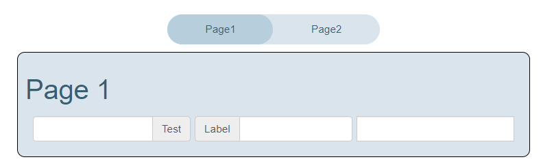

# TmplitTabs

This is a tab control for tmplits. It has selectable tabs and a content area that is shown when the tab is selected.



## Usage

The lui-tab-control is a web component. The properties are:

* value: The index of the selected tab. Starts at 0.
* A series of templates that are the tabs. The title attribute is the text of the tab. The content of the template is the content of the tab

If tabs are not active, they are completely removed from the DOM. This means that the process variables used in the tab can be disabled when the tab is not active.

It can be used directly in HTML or in a tmplit template.

```html
    <lui-tab-control value="1">
        <template title="Page1">
            <h1>Page 1</h1>
        </template>
        <template title="Page2">
            <h1>Page 2</h1>
        </template>
    </lui-tab-control>
```
```handlebars
    {{#tmplit 'Tabs' value='2'}}
        <template title="Page1">
            <h1>Page 1</h1>
            {{> page1 msg="hello"}}
        </template>
        <template title="Page2">
            <h1>Page 2</h1>
            {{> page2 "hello world 2"}}
        </template>
    {{/tmplit}}
```
